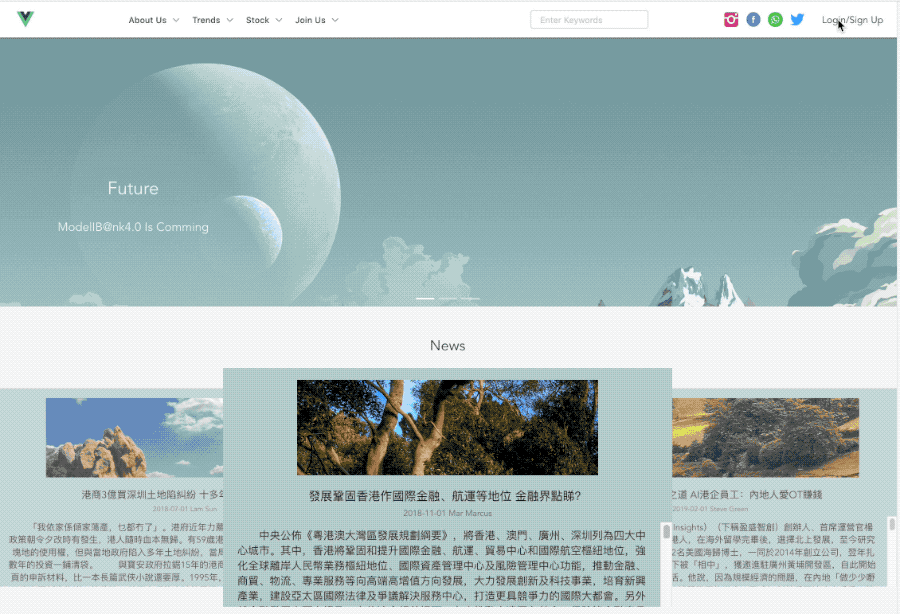
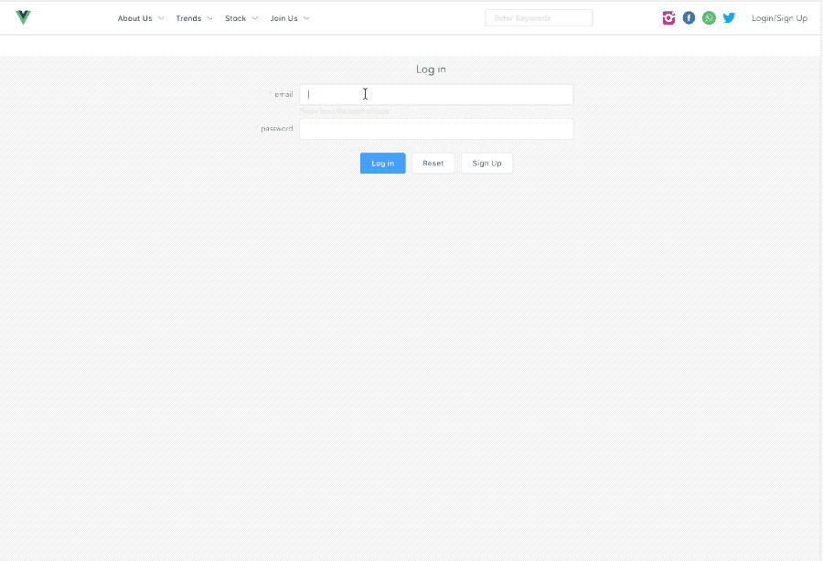
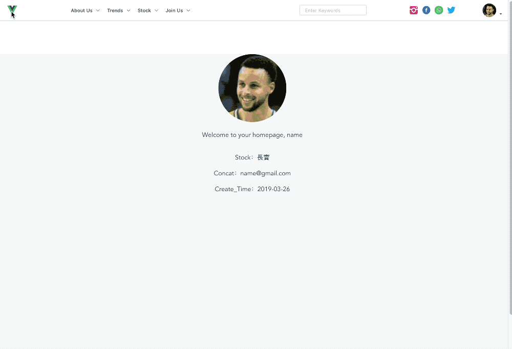
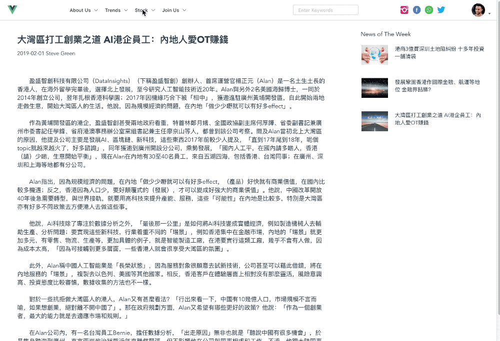

# finance_web

```
Vue ----> foreground exhibit
axios ----> fetch data
Node(Express) -----> Rest API
MongoDB(Mongoose)
```

## Run Project

```
npm install
npm run start  ------> server and database
npm run serve   -------> foreground exhibit
```

## Main function

1. Sign Up

   - JWT: Create token when register, and save it in database
   - Upload Avatar: Save avatar's url in database and storage it in server's public folder `server/public/upload/YYYY-MM-DD/filename`
   -



2. Log in

   - After log in success, save token in localstorage (official recommendations by JWT and the other project use cookie to save token：https://github.com/chowchunlok/finance_admin/tree/dev)

   - Check client's token every router changing in `/src/router.js`

     ```
     router.beforeEach((to, from, next) => {
     	let token = localStorage.getItem('token')
     	if (to.meta.requireAuth) {  // Pages need permission
     		if (token) {
     			next()
     		} else {
     			next({
     				path: '/user/login',
     				query: { redirect: to.fullPath }
     			})
     		}
     	} else {
     		next()
     	}
     })
     ```



3. News



4. Stock Chart



5. Article

- Edit by Rich Text Editor, a backstage management web project: [finance_admin](https://github.com/chowchunlok/finance_admin/tree/dev)
  

* Rich Text Editor is based on [Tinymce](https://www.tiny.cloud/get-tiny/custom-builds/)

  6.Some pages and features are not yet completed…

## what is next to do?

SEO

lang

React Version

Use ES7(async/await) in server

…
